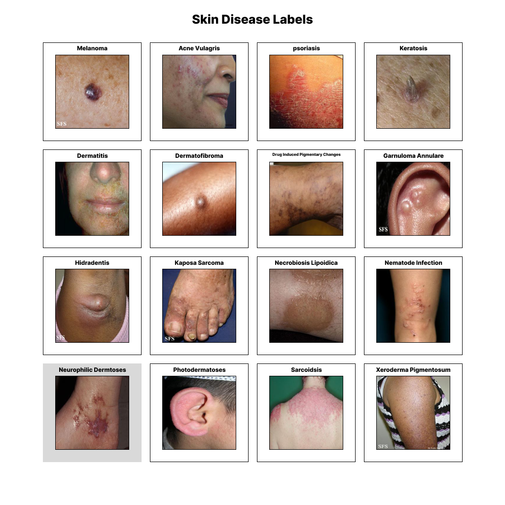

# Dermapal-AI-Model

## Implementation of a Convolutional Neural Network for Skin Disease Detection

The implementation uses the Fitzpatrik dataset of over 16,000 images spanning over 117 different skin diseases

## Data

## Custom Model 1

## Transfer Learning Model

## Data Augmentation + Custom CNN

## Results

## Conclusion